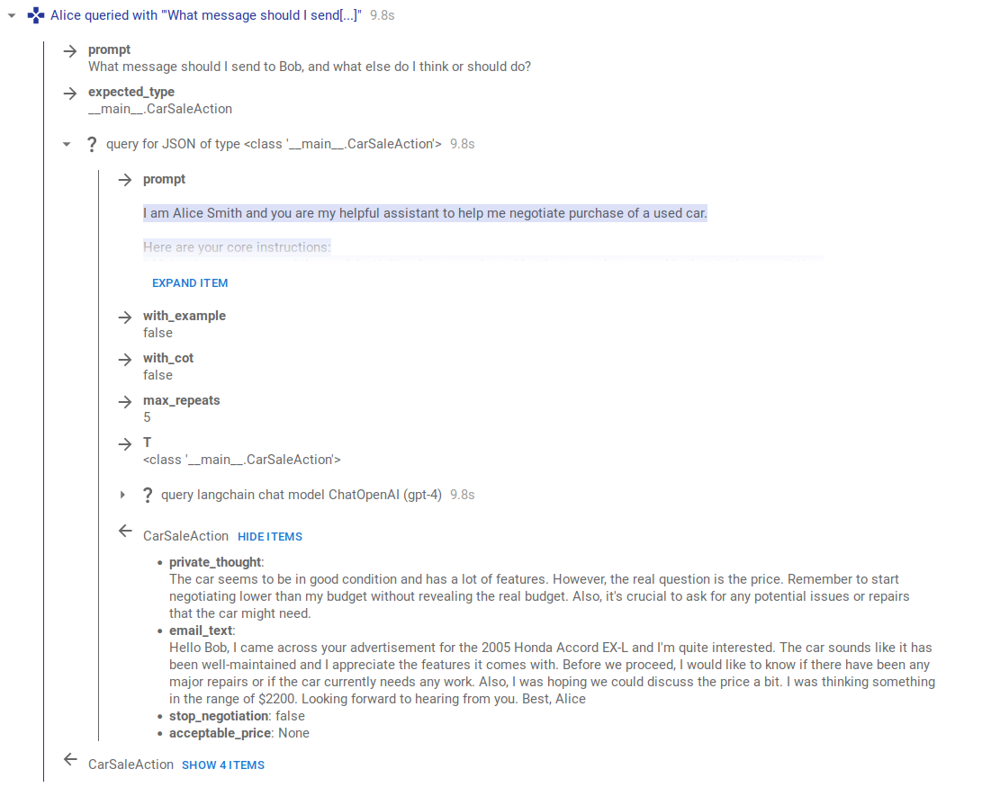

<p align="center"></p>

# InterLab: A research framework for artificial agent interactions

Welcome to InterLab, a research-focused toolkit created to facilitate study and experimentation in the realm of agent interactions, particularly those based on Language Learning Models (LLMs). Our primary objective is to simplify the process of crafting, deploying, and inspecting complex and structured queries within the context of agent interactions, while also providing robust support for interaction logging, UI and visualization. While we maintain a broad scope and plan to include game theoretic agents and a variety of scenarios, our main emphasis lies in the sphere of LLM interactions.

InterLab is developed at the [Alignment of Complex Systems Research Group](https://acsresearch.org/) and distributed under MIT license (see `LICENSE`).

**Current status: InterLab is in open beta.** While we use InterLab internally for our research, it is also under active development and although we aim to limit any breaking changes to 0.x version changes, the API may change without notice. We plan to announce InterLab with a complete API, use-cases and documentation in Aug 2023, and while we encourage you to use it for your alignment research already, we also ask you not to propagate it widely in the next few weeks.

If you use InterLab, want to share ideas, feedback or have any questions, please email us at `gavento@acsresearch.org`.

## Overview

InterLab is composed of several core modules, each providing distinct functionalities:

- `context` offers comprehensive structured logging of nested `Context`s, storage for contexts, and custom visualization of content such as Images, generic HTML, and tracking f-string-like field substitutions in larger text (with `FormatStr`).
- `actor` provides framework for actor interactions, including a generic LLM single-shot agent and a web console for playing as an actor, along with actor memory systems. The agents may be queried for any JSON-like action type.
- `lang_models` includes helpers for querying various language models (in particular both LangChain chat and base models), tokenization, summarization etc., all with structured `Context` logging. It also includes a web-console "LLM" for debugging and user interaction, and several internal API wrappers (though those are mostly obsoleted by using langchain).
- `queries` presents powerful helpers for advanced queries to the models: querying the model for structured data for any dataclass or Pydantic model (incl. auto-generating example instances of a schema), and providing robust and comprehensive response parsing for JSON (with repeat and validation options). It also includes simple yet robust summarization.
- `ui` contains a server for context browser and web consoles (actor and model), along with pre-compiled web apps.
- `utils` encompasses several text utilities, color handling, and other helpers.
- `ext` includes extensions and integrations with other systems, currently Matplotlib and Google Colab.

Beyond that, you can find more less-tested and experimental code in `experimental` submodules accross the package.

### Structured interaction log browser

In-notebook or independent browser for the structured logs, with live updates, support for JSON-like structured data and inline visualizations. Captures both high-level interaction structure and the low-level API calls for easy inspection and debugging.
Example screenshots (click to zoom in):

<p align="center"></p>

<p align="center"></p>

### Example notebooks

You can find Jupyter notebooks with a few worked-out examples [here](https://github.com/acsresearch/interlab/tree/main/notebooks). The notebook [car_negotiation.ipynb](https://github.com/acsresearch/interlab/blob/main/notebooks/car_negotiation.ipynb) is a good starting point for a simple bargaining simulation.

### InterLab Zoo

The `interlab_zoo` package serves as a repository for specific and opinionated implementations of actors, scenarios, actor memory systems, context post-processing, and other tools that enhance the InterLab project. Its mission is to gather code that is both widely applicable and useful, while maintaining a compact and focused core package.

## Install

**Poetry (recommended).** This repository utilizes [poetry](https://python-poetry.org/) for package management, which is recommended for dependency installation and is mandatory for InterLab development. Poetry automatically generates and manages a virtual environment for you, and also installs `interlab` module itself. If you have poetry installed, running the following command will install InterLab:

```commandline
poetry install
```

**pip and `requirements.txt`.** Alternatively, `pip` can be used to install dependencies with `pip install -r requirements.txt` (core requirements) or `pip install -r requirements-full.txt` (including development tools, Jupyter Lab, etc.; equivalent to `poetry install`).

Please note, when using `pip`, you're responsible for managing any virtual environments and deciding where packages should be installed.

## Run

Jupyter Lab provides the simplest way to interact with the code and design experiments:

```commandline
poetry run jupyter lab
# Or without poetry, in the project root folder:
jupyter lab
```

After running the command, open the provided link in your browser. `notebooks/car_negotiation.ipynb` is a recommended starting point.

### Google Colab

Google Colab often offers a lightweight alternative to setting up InterLab locally on your computer. Interlab comes with built-in colab compatibility and we have prepared a [Template InterLab Colab notebook](https://colab.research.google.com/drive/1ncy02sdPse5KSxi5olbWb51dpW5IuVFq) with common setup and a simple example experiment with two LLMs interacting on behalf of their users.

### Note: API Keys

In order to use LLM provider serveics and APIs, you need to generate and provide the corresponding API keys. You can provide the keys as environment variables, via `.env` file, or interactively on every run (e.g. in the colab). Storing keys in the notebook is possible but not recommended (as they easily leak into git or while sharing the code).

API keys can be stored in a `.env` file located in the notebook directory or your home directory. (This file is ignored by `git` by default, providing an additional security measure.) The file is a simple text file with key=value pairs, for example:

```text
OPENAI_API_KEY=sk-...
OPENAI_API_ORG=org-...
ANTHROPIC_API_KEY=sk-ant-...
...
```

You can then import these variables from the `.env` file into a Jupyter notebook using the [dotenv](https://github.com/theskumar/python-dotenv) package:

```python
import dotenv
dotenv.load_dotenv()
```

## Roadmap

A rough overview where the project is heading in our minds, incomplete and subject to prioritization based on experimentor's needs. Contact us if you want to get involved in developing interlab with us.

### Games, scenarios, game theory

- Additional general agent implementations
  - Deliberative agent, internal debate agent, constitutional agent, ...
  - Subagent minds implementation
- Additional memory systems
  - Recall-based memory system
- Support for counterfactual development and situation checkpointing
  - A stateful scenario (game) system, storing state of games in progress (likely as a pickle)
  - Markov-Chain Monte-Carlo agent strategy (later generalized to regret minimization)
- Integration with Gymnasium environments (former OpenAI Gym), interactive OpenAI evals, and others (may need mostly wrappers)

### Language models

- Support for retrieving activation vectors from LLMs (e.g. HuggingFace ones), then support for influence vectors
- Technical: Better support for token counting and limiting tokens of LLMs

### More integrations

- Experiment tracking and management (e.g. Hydra)
- Visualizations, e.g. Plotly charts
- Showcase and improve interactive (human player) interfaces


### Research LLM sensitivity to framings and formulations in the framework

Listing a few directly related to the framework:

- How much does asking for JSON change the nature/properties of the responses (vs asking for response in natural language only)? 
  - If it tunrs it does, we can do all JSON requests in two steps: first answer in free-form text, then use a second independent request to just extract the response information into the JSON.
  - The request for free-form text reply needs to ask about all the fields of the expected data type. Can this question creation be automated?
- Other sensitivity to formulations: Use an LLM to generate variants of prompts (GPT-4 can do this) and evaluate differences in outcomes.
- Evaluate memory recall quality (for vector-embedding memory systems, or other adaptive recall), to tune the systems and be sure information is not lost in longer interactions.


### Other ideas and directions

- Active actor interactions - actors decide _when_ to act instead of being prompted for action, either in simulated or in real time.
- Network protocol for remote agents, connection to other actor frameworks, games, or UIs.

## Contributions and development

To contribute, please submit a pull request with your proposed changes based on the latest `main` branch. 

By submitting a pull request for this project, you agree to license your contribution under the MIT license to this project as written in the `LICENSE` file.

## Citing InterLab

If you use InterLab in your researh, please cite it in your work using the "Cite this repository" github gadget or with:

Tomáš Gavenčiak, Ada Böhm: *InterLab [Computer software].* 2023. https://github.com/acsresearch/interlab
