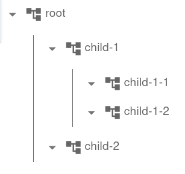

# Contexts

InterLab Contexts are a framework for logging, tracing, storing results and
and visualisation of nested computations and actor interactions.
They are designed to support large textual and structured (e.g. JSON) inputs and outputs, as well as generic and custom visualisations.
custom visualisations.

An instance of [Context](pdoc:interlab.context.Context) is a core object of InterLab logging infrastructure and
represents a single (sub)task in a nested hierarchy.


## Using a Context as a context manager

To utilize a Context within your code, here's a pattern involving `with` statements:

```python
from interlab.context import Context

with Context("my context", inputs={"x": 42}) as c:
    y = do_a_computation(x=42)
    c.set_result(y)
```

## Hierarchically Nested Contexts

Contexts can be nested to construct a clear hierarchy reflecting the structure of a complex computation:

```python
with Context("root") as root_ctx:
    with Context("child-1"):
       with Context("child-1-1"):
           pass
       with Context("child-1-2"):
           pass
    with Context("child-2"):
       pass
```

If this context are visualized in [Data Browser](databrowser.md) or in Jupyter notebook via `root_ctx.display()`:



## Context states

Throughout its lifetime, a context traverses several states:

* *New* -  Freshly instantiated Context
* *Open* - Running context
* *Finished* - Successfully finished context
* *Error* - Unsuccessfully finished context

```python
ctx = Context("my context")  # Context in NEW state
with ctx:
    # Context in OPEN state
    compute_something()
# Context in FINISHED state
```

When an unhandled exception passes through a context boundary, it sets the context to the ERROR state. Example:

```python
with Context("my context"):
    raise Exception("Something is wrong")
# Context in ERROR state
```

Alternatively, the `.set_error(error)` method can be called on context to explicitly set a context to the ERROR state.

## Managing Inputs and Results

Context may have one or more named inputs and at most one result

```python
from interlab.context import Context

with Context("my context", inputs={"x": 42}) as c: # Set inputs when context is created
    c.add_inputs({"y": 123, "z": 321})  # Add inputs dynamically
    c.set_result("my_result")  # Set result explicitly
```

The name of the input has to be string.

## Enhancing Functions with `with_context`

A function can be annotated with [with_context](pdoc:interlab.context.with_context) decorator. It automatically
creates a new context that captures inputs and the result when the function is called.

```python
from interlab.context import with_context

@with_context
def my_computation(x):
    ...
```

## Events

An event is an instant context with immediate result and no child contexts.

```python
with Context("root") as c:
    c.add_event("Message to Alice", kind="message", data="Hi, Alice!")
```


## Tags

Utilizing Tags

Tags are custom identifiers attachable to any Context, facilitating subsequent filtering based on these tags. A tag is either directly a string or an instance of [`Tag`](pdoc:interlab.context.Tag).

Tag appearances in the Data Browser can be customized with an associated HTML color:


```python
from interlab.context import Context, Tag

with Context("root", tags=["tag1", Tag("tag2")]) as ctx:
    c.add_tag("exp1")  # Add tag to a context dynamically
    c.add_tag(Tag("success!", color="lightgreen"))  # Add a tag with custom color
```

## Attaching Meta information

A meta information can be attached to every context.
It is a dictionary with string keys. Keys and values may be user defined; however, some keys are recognized by
DataBrowser and influences how the context is rendered.

```python
with Context("root", meta={"key": "value"}) as ctx:
    pass
```

InterLab specifically recognizes and utilizes the following metadata keys, influencing the visual rendering in the Data Browser:

* "color": [HTML color] - Defines the main color of the Context. In the current version, it is used for the title of context and a line when context is expanded.
* "color_bg": [HTML color] - Sets the Context's background color.
* "color_border": [HTML color] - Draws a border with the specified color around the Context.
