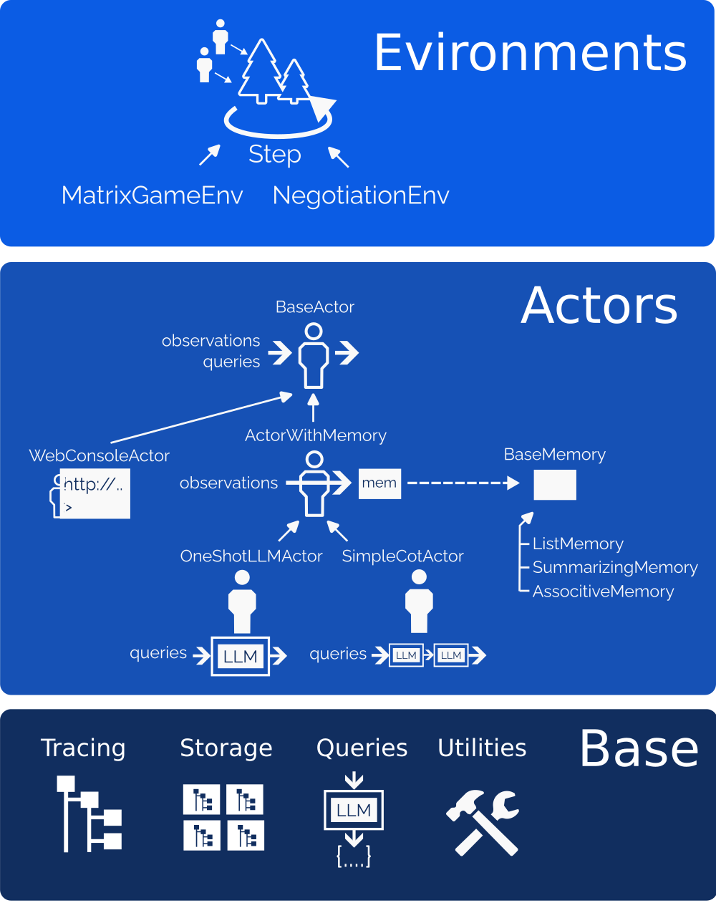

# Overview

At its core, InterLab offers three fundamental layers, each tailored to seamlessly support different aspects of your research experiments:

## Base Layer

Base layer serves as the foundation, our base layer presents a generic environment tailored for experimental design. Key features include:

* Tracing: Easy monitoring with auto-logged actions structured in a tree format. Our web explorer enhances visibility, allowing users to delve deeper on-demand. Additionally, this layer offers a dynamic inspection of ongoing experiments which is quite handy for tracking progress and making timely decisions, such as halting an experiment if necessary.
* Storage: Benefit from a hassle-free experience with automatic data management for saving and retrieving experimental work.
* LLM Queries: Simplify interactions with language models through our querying API that intelligently structures responses into Python data structures.

## Actor Layer
At this level, we introduce the concept of an "Actor", a fundamental entity equipped with two key operations: "observe" and "query".
The "observe" function enriches an Actor's memory without yielding a direct return output.
Conversely, "query" solicits a response from the Actor, seeking information on potential actions or internal state assessments.
For instance, envision an Actor designed for playing tic-tac-toe: the "observe" operation records the moves, while a "query" might request the next best move as 'circle'.
InterLab provides you with the framework to customize your own Actor, along with standard implementations suited for typical scenarios, including a one-shot LLM Actor and a chain-of-thought Actor with memory variants ListMemory (remembers everything), SummarizingMemory (summarize events), and AssociativeMemory (recall events related to a query).
The Actor layer integrates with the base, ensuring that both observations and queries are systematically logged into the tracing node tree.
We also offer an interactive web console actor, empowering you to step in as an Actor and steer experiments in real-time as needed.
Environment Layer: This layer represents an abstract canvas that encapsulates a scenario's state, facilitating the progression to a subsequent step. In this versatile sphere, users are free to introduce their custom environments, while we also provide standard settings such as those for matrix games or negotiation environments.

## Environment Layer

Environment layer represents an abstract canvas that encapsulates a scenario's state, facilitating the progression to a subsequent step. In this versatile sphere, users are free to introduce their custom environments, while we also provide standard settings such as those for matrix games or negotiation environments.

## Schema

