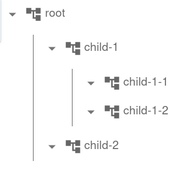

# Tracing

InterLab tracing nodes are a framework for logging, tracing, storing results and
and visualisation of nested computations and actor interactions.
They are designed to support large textual and structured (e.g. JSON) inputs and outputs, as well as generic and custom visualisations.
custom visualisations.

An instance of [TracingNode](pdoc:interlab.tracing.TracingNode) is a core object of InterLab logging infrastructure and
represents a single (sub)task in a nested hierarchy.


## Using a TracingNode as a context manager

To utilize a TracingNode within your code, here's a pattern involving `with` statements:

```python
from interlab.tracing import TracingNode

with TracingNode("my node", inputs={"x": 42}) as c:
    y = do_a_computation(x=42)
    c.set_result(y)
```

## Hierarchically nested tracing nodes

TracingNodes can be nested to construct a clear hierarchy reflecting the structure of a complex computation:

```python
with TracingNode("root") as root:
    with TracingNode("child-1"):
       with TracingNode("child-1-1"):
           pass
       with TracingNode("child-1-2"):
           pass
    with TracingNode("child-2"):
       pass
```

If this tracing nodes are visualized in [Data Browser](databrowser.md) or in Jupyter notebook via `root.display()`:



## TracingNode states

Throughout its lifetime, a TracingNode traverses several states:

* *New* -  Freshly instantiated TracingNode
* *Open* - Running TracingNode
* *Finished* - Successfully finished TracingNode
* *Error* - Unsuccessfully finished TracingNode

```python
node = TracingNode("my node")  # 'node' in NEW state
with node:
    # 'node' in OPEN state
    compute_something()
# 'node' in FINISHED state
```

When an unhandled exception passes through a ContentNode boundary, it sets the node to the ERROR state. Example:

```python
with TracingNode("my node"):
    raise Exception("Something is wrong")
# TracingNode in ERROR state
```

Alternatively, the `.set_error(error)` method can be called on a node to explicitly set the node to the ERROR state.

## Managing Inputs and Results

Nodes may have one or more named inputs and at most one result

```python
from interlab.tracing import TracingNode

with TracingNode("my node", inputs={"x": 42}) as node:  # Set inputs when tracing is created
    node.add_inputs({"y": 123, "z": 321})  # Add inputs dynamically
    node.set_result("my_result")  # Set result explicitly
```

The name of the input has to be string.

## Enhancing Functions with `with_tracing`

A function can be annotated with [with_tracing](pdoc:interlab.tracing.with_tracing) decorator. It automatically
creates a new `TracingNode` that captures inputs and the result when the function is called.

```python
from interlab.tracing import with_tracing


@with_tracing
def my_computation(x):
    ...
```

## Events

An event is an instant TracingNode with immediate result and no child nodes.

```python
with TracingNode("root") as node:
    node.add_event("Message to Alice", kind="message", data="Hi, Alice!")
```


## Tags

Utilizing Tags

Tags are custom identifiers attachable to any TracingNode, facilitating subsequent filtering based on these tags. A tag is either directly a string or an instance of [`Tag`](pdoc:interlab.tracing.Tag).

Tag appearances in the Data Browser can be customized with an associated HTML color:

```python
from interlab.tracing import TracingNode, Tag

with TracingNode("root", tags=["tag1", Tag("tag2")]) as node:
    node.add_tag("exp1")  # Add tag to a tracing node dynamically
    node.add_tag(Tag("success!", color="lightgreen"))  # Add a tag with custom color
```

## Attaching Meta information

A meta information can be attached to any `TracingNode`.
It is a dictionary with string keys. Keys and values may be user defined; however, some keys are recognized by
DataBrowser and influences how the tracing node is rendered.

```python
with TracingNode("root", meta={"key": "value"}) as node:
    pass
```

InterLab specifically recognizes and utilizes the following metadata keys, influencing the visual rendering in the Data Browser:

* "color": [HTML color] - Defines the main color of the tracing node. In the current version, it is used for the title of node and a line when the node is expanded.
* "color_bg": [HTML color] - Sets the TracingNode's background color.
* "color_border": [HTML color] - Draws a border with the specified color around the TracingNode.
