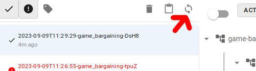

# Data Browser

## Static and dynamic visualtion of tracing nodes

There two main ways how visualize a `TracingNode`:

* *Static* - creates a standalone HTML code that captures a snaphost of the current state of the tracing node.
  Visulation is not updated when the nodes evolves.
* *Dynamic* (live) - it dynamically reflects the current state of the node. It needs a running storage server ([Storage](storage.md));

## Static view

To create a static view you can call `.create_html(path)` that create a HTML file that contains a visualization of the node.

In Jypter notebook you can directly call `.display()` on a node to create a static view of the node
that is immediately shown in Jupyter.

## Live Data Browser as a stand-alone page

Live data browser works only when node is stored in a storage.

Method `.start_server()` returns a handle where a HTTP server is running.

```python
storage = FileStorage("./my-directory")
storage.start_server()  # returns <ServerHandle http://localhost:PORT>
```

The Data browser is running on the given address.
If you register the root node in the storage, e.g.:

```python
with TracingNode("my test", storage=storage):
    with TracingNode("a child"):
        pass
    with TracingNode("a child"):
        pass
```

and refreshes the view then a new node occurs. The icon for refreshing Data Browser is shown in the following figure:



## Live Data Browser in Jupyter

In Jupyter notebook, a storage have a method `.live_display` that internally
starts the server shows a Data Browser directly in Jupyter notebook.

```python
storage = FileStorage("./my-directory")
storage.live_display() # Shows Data browser in the resulting Jupyter output cell
```


## Embedded HTML

TODO

## Data with MIME type

TODO